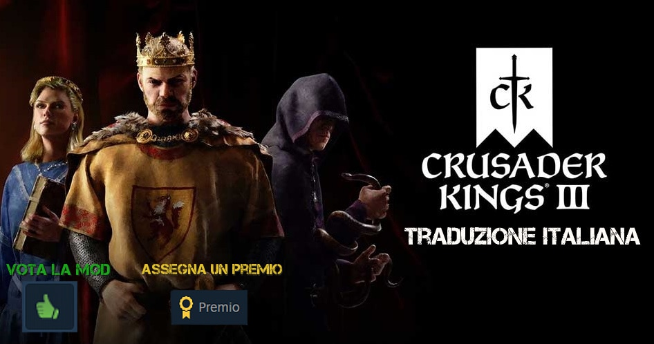

  
  
  
  

> **Traduzione realizzata dal gruppo di traduttori amatoriali TWR**

**Versione della mod:** 1.16.2.3  
**Patch della mod:** Settembre v.5

È possibile seguire lo stato di completamento della traduzione su Discord, nel canale `#stato-traduzione`.

Vi preghiamo di supportarci nell'acquisto dei nuovi DLC. Quello che per voi è un semplice caffè per noi significa molto, poiché ci permette di tenere vivo questo progetto.  
Ko-fi: <https://ko-fi.com/woldren93> (collegato a PayPal, sito sicuro)

### DLC — stato
| DLC                         | Stato                             |
|-----------------------------|-----------------------------------|
| Northern Lords              | ✅ Completato                     |
| Royal Court                 | ✅ Completato                     |
| Fate of Iberia              | ✅ Completato                     |
| Friends & Foes              | ✅ Completato                     |
| Tours & Tournaments         | ✅ Completato                     |
| Legacy of Percia            | ✅ Completato                     |
| Legends of the Dead         | ✅ Completato                     |
| Wards & Wardens             | ✅ Completato                     |
| Roads to Power              | ❌ In corso — 1 file rimanente    |
| Wandering Nobles            | ✅ Completato                     |
| Khans of the Steppe         | ❌ Non tradotto                   |

Nel launcher è possibile disattivare il DLC non ancora tradotto per avere il gioco completamente in italiano.

---

## Guida per l’installazione
1. Sottoscrivi la mod su Steam Workshop e assicurati che sia abilitata nel launcher.  
2. Apri **Playsets** e verifica che a destra ci sia una spunta verde.  
3. Vai su **Game Settings** e imposta la lingua **spagnola**. È la lingua sovrascritta con l’italiano.  
4. Avvia il gioco.

---

## Elenco traduttori
Woldren, Darmac, ZeXoGod, TheInvisible1, Louis, Polyzen, Akirak, QUISER, Brukino, spectro75, Ruxsha, Toraky, FullDark98, Khalix94, Ace The Brave, Anonymus, Rano05, Rick, GC_SpiritFreedom, Hero, Deky, Darkraffa, Hustinov, EspositoBoys, Lorthirk, C\|lr4d.

---

## Link utili
- Steam Workshop: <https://steamcommunity.com/workshop/filedetails/?id=2262243033>  
- Discord: <https://discord.com/invite/MkQs9sSB32>  
- Facebook: <https://www.facebook.com/profile.php?id=100028543285650>  
- Ko-fi: <https://ko-fi.com/woldren93>

